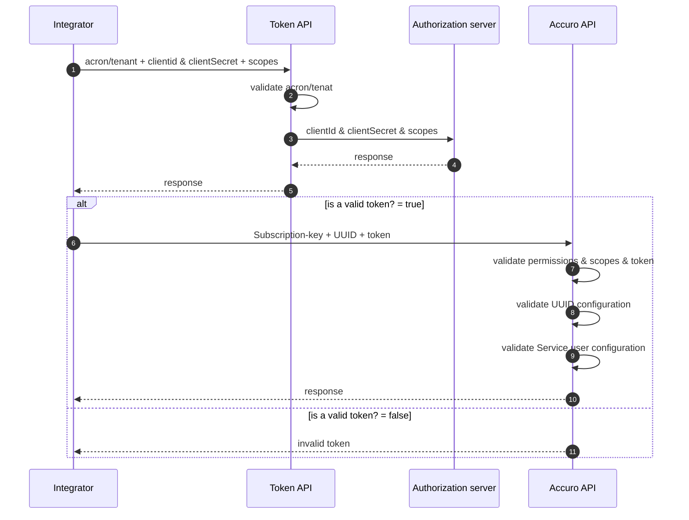

# Authentication

In order to authenticate and access a specific Accuro instance, a certain number of configurations must first be performed. QHR handles the management of these configurations and will provides the credentials to the appropriate clinic/integrator.

A member of the integrator will receives the following information from QHR that is required to grant a token:

- The clientId and clientSecret.
- The tenant/acron value of their Accuro instance.
- The scopes associated to its configuration.

Preconfigurations managed by QHR:

- Configuration of the integrator's application on the QHR authorization server.
- Configuration of authorization by the clinic to integrate the third party application.
- Third application activation configuration.
- Turning on the integrator in the Developer Portal.

## Client credentials flow



:::info

The subscription key must be **generated** by the integrator in the Developer Portal.

:::

### Base URL

On receiving access to the Accuro API, you will receive the base URLs for the sandbox environment where 
you’ll be able to develop and test your application against test data. Once you are at the stage of connecting to a clinic’s Accuro, you will receive a production configuration and the base URL for the production instance of Accuro API.

## Token Generation

<details>
 <summary><code>POST</code> <code><b>accuro-base-url/</b></code> <code>v1/token</code></summary>

 ##### Headers

> | name           |  type     | data type                                    | description                      |
> |----------------|-----------|----------------------------------------------|----------------------------------|
> | Content-Type   |  required | application/x-www-form-urlencoded            | none.
> | Authorization  |  required | Basic base64encode client_id:client_secret   | none.
> | grant_type     |  required | client_credentials                           | none.
> | scope          |  required | scopes1,scope2,scope3 ...                     | none.

##### Parameters

> | name      |  type     | data type               | description                                                           |
> |-----------|-----------|-------------------------|-----------------------------------------------------------------------|
> | tenat     |  required | string                  | accuro instance identifier.


##### Responses

> | http code     | content-type                         | response                                                            |
> |---------------|--------------------------------------|---------------------------------------------------------------------|
> | `200`         | `application/json`                   | `{"token_type":"Bearer","expires_in":3000, "access_token": "eyJraWQi...", "scope":"scope1, scope2, scope3"}`|
> | `400`         | `application/json`                   | `{"code":"400","message":"Bad Request"}`                            |
> | `401`         | `application/json`                   | `{"code":"401","message":"Unauthorized"}`                                 |


</details>

```js title="-cURL example"
curl --location --globoff '{{Accuro API base url}}/v1/token?tenant={{YOUR-ACRON}}' \
--header 'Content-Type: application/x-www-form-urlencoded' \
--header 'Authorization: Basic YOUR-TOKEN' \
--data-urlencode 'grant_type=client_credentials' \
--data-urlencode 'scope=YOUR-SCOPES'
```

------------------------------------------------------------------------------------------

### Refreshing your access token

To maintain access to the clinic's Accuro, you have to continually refresh your access token. Access tokens have an expiry of 1 hours. The `expires_in` field indicates (in seconds) how long the access token is valid for from now.

You are only able to use a refresh token once. Refreshing a token will return a new valid access token as well as a new refresh token to use for the next refresh.

```text title="POST url/v1/token?tenant=acron/tenant"
{
    "token_type": "Bearer",
    "expires_in": 3600,
    "access_token": "eyJraWQiOiJydjctczJaMFhBbEZCMjRYYnUyUU9qbUtSSUNiNy1JTmRvQ2tTWWdkdm9BIiwiYWxnIjoiUlMyNTYifQ.eyJ2ZXIiOjEsImp0aSI6IkFULjhtMl9GaEhCT2ZieWN3alpRRE8yRHRNRFJHRmVnNjlYVUJxOGJIZ253OXciLCJpc3MiOiJodHRwczovL29rdGEtcS5xaHJ0ZWNoLmNvbS9vYXV0aDIvZGVmYXVsdCIsImF1ZCI6ImFwaTovL2RlZmF1bHQiLCJzdWIiOiIwb2Exb3g2aDlkdXZPbHRUYTBoOCIsImlhdCI6MTY4NzkxMTkwNCwiZXhwIjoxNjg3OTE1NTA0LCJjaWQiOiIwb2Exb3g2aDlkdXZPbHRUYTBoOCIsInNjcCI6WyJMRVRURVJfUkVBRCIsIkNMSU5JQ0FMX05PVEVTX1dSSVRFIiwidlci9wcm92aWRlci5BcGlLZXkuY3JlYXRlIiwidXNlci",
    "scope": " Score1 Scope2 Scope3 Scope n"
}

```

## Provider Permissions

Provider Permissions set for the **Service User** impacts what data will client applications will be allowed to access through Accuro API. When authenticating to Accuro API through this mechanism, Provider-based authentication, client applications must be aware of how their requests are impacted by Provider Permissions. When setting Provider Permissions for a user, they can be given access to the following categories:

- Patient - Able to change a patient’s provider
- Scheduling - View and modify appointments for the provider
- Billing - View and modify billing data for the provider
- Inbox - View a provider’s inbox, e.g. see which labs or documents are in a provider’s inbox for review
- EMR - Enables a provider to be selected from various dropdown lists 
- Labs - View and modify lab tests and results for the provider 
- Reporting - Includes the provider in reports
- Visible - Includes the provider in selection dropdowns etc.
- Prescribe For - View and modify prescriptions by the provider
- Access Until - The preceding permissions are only in effect and give access to the provider until the set date

Some permissions can have either Full Access (able to read and write data) and Read-Only Access (able to 
read data only). Currently, the provider permissions enforced by Accuro API are the Patient, Scheduling, Billing, EMR, and Labs. 

[More details](/docs/accuro-api/provider-permissions)

## Making requests to Accuro API

### Accuro UUID

QHR will provides the _uuid_ of the clinic's Accuro to the user/integrator. It's highly recommended that your application provide a way to associate their account or clinic with the _uuid_ of their Accuro; the _uuid_ is required to be passed as a query parameter on every request to the Accuro API.

The _uuid_ of an Accuro instance is available in Accuro in _Accuro Start Menu > Search 'View Log' > System Information.txt > Database UUID_

### Accuro Subscription key

To access QHR’s APIs, users of the QHR Developer Portal need to subscribe to an API Product. They can do this by visiting the API Console, browsing the available products, and submitting a subscription request. QHR will then review the request and grant access if approved. 

Unlike the  _uuid_ the _Subscription-Key_ must be sent in the header of the Accuro API request.

---------------------------------------------------


## Example

<details>
 <summary><code>GET</code> <code><b>accuro-base-url/</b></code> <code>/rest/v1/offices</code></summary>

 ##### Headers

> | name                        |  type     | data type                                    | description                      |
> |-----------------------------|-----------|----------------------------------------------|----------------------------------|
> | Content-Type                |  required | application/x-www-form-urlencoded            | none.
> | Authorization               |  required | bearer eyJraWQiOiJyd...                      | none.
> | X-QHR-Subscription-Key      |  required | 23456abcdfg456789abcds                       | none.


##### Parameters

> | name      |  type     | data type               | description                                                           |
> |-----------|-----------|-------------------------|-----------------------------------------------------------------------|
> | uuid      |  required | string                  | accuro instance identifier.
> | phn       |  required | string                  | none.

##### Responses

> | http code     | content-type                         | response                                                            |
> |---------------|--------------------------------------|---------------------------------------------------------------------|
> | `200`         | `application/json`                   | `[{...Patient1...},{...patient2...}];`                              |
> | `400`         | `application/json`                   | `{"code":"400","message":"Bad Request"}`                            |
> | `401`         | `application/json`                   | `{"code":"401","message":"Unauthorized"}`                           |

</details>

```js title="-cURL"
curl --location --globoff '{{Accuro API base url}}/rest/v1/offices?uuid={{uuid}}' \
--header 'Authorization: bearer {{auth_provider}}' \
--header 'Accept: application/json' \
--header 'Content-Type: application/json' \
--header 'X-QHR-Subscription-Key: {{Subscription-Key}}'
```

------------------------------------------------------------------------------------------