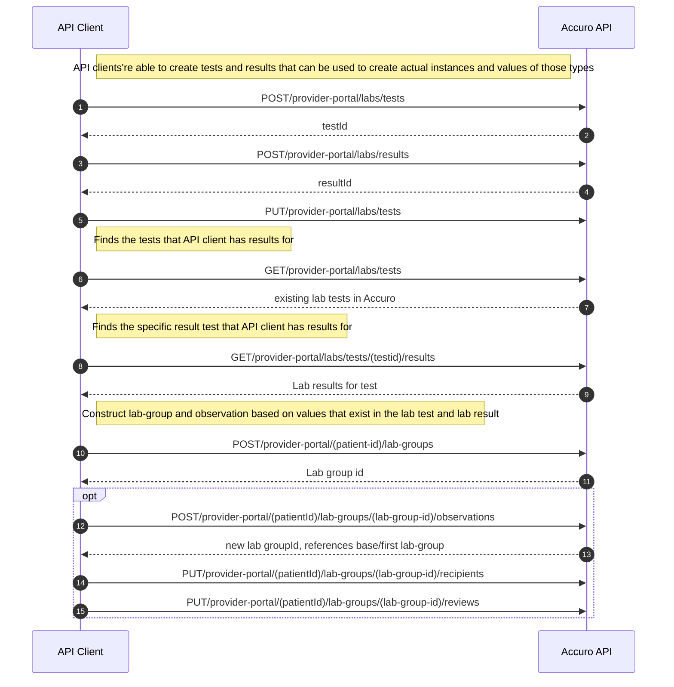
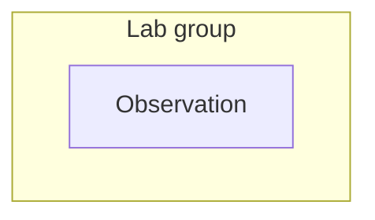
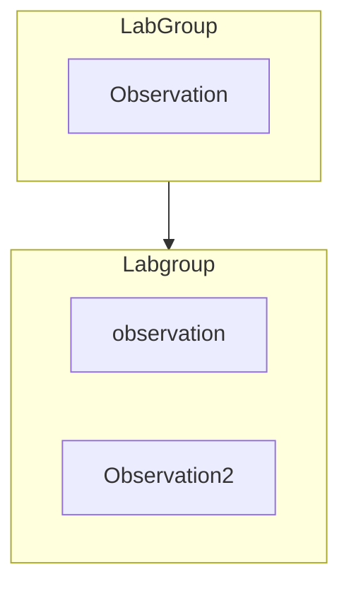

# Adding Labs and Observations

## Key Concepts

_Lab Test_ The name of a particular test which contains result types. It is a container object to indicate which type of results will be recorded. It's possible that a single test will have multiple measurements (these different types of measurements correspond to result types in Accuro API).

_Lab Result_ A template which can be used to create an observation to be included in a particular lab-group. Includes things like units of measurement, reference ranges, data type, description etc.

_Lab Group_ An instance of a lab test, including a number of different types of dates, ordering physician information, review data, internal/external notes. It contains the results that are produced by the test called 'observations'.

_Observation_ An instance of a lab result, includes the actual result value, notes, label to be used when displaying the observation, reference range units etc.

## Workflow



## Constructing a lab-group and observation

**Lab groups** are a particular instance of a **lab test**. As such much of the information required to create a **lab group** comes from the **lab test** object. **Observations** are instances of **lab results**. As such much of the information comes from the **lab result** object.

### Lab Test

Use this information to construct a **Lab Group**.

```js
{
  "testId" : 42,
  "testName" : "CHOL Panel",
  "sourceId" : null,
  "active" : true
}
```

### Lab Result

Use this information to construct an **Observation**.

```js
{
  "resultId" : 42,
  "resultName" : "BP - Diastolic",
  "dataType" : "Numeric",
  "units" : "mmHG",
  "sourceId" : null,
  "imperial" : false,
  "description" : "Arterial pressure between heart beats.",
  "referenceRange" : "< 80",
  "active" : true
}
```

### Lab Group + Observation

Using both the **Lab Test** and the **Lab Result** data, you can construct a **Lab Group**. The Lab Group has additional information like a patient ID, various dates, notes, result values and flags etc.

```js
{
  "active" : true,
  "patientId" : <Prerequisite Info>,
  "testId" : <LabTest.testId>,
  "sourceId" : <LabTest.sourceId>,
  "orderingProviderId" : <Prerequisite Info>,
  "internalNote" : "An example note.", // Optional
  "externalNote" : "An example note.", // Optional
  "collectionDate" : "1999-12-11T18:11:25.343-0800",
  "transactionDate" : "2017-12-07T13:38:00.000-0800",
  "observationDate" : "2017-12-07T13:38:00.000-0800",
  "versionDate" : "2017-12-07T13:38:00.000-0800",
  "reviewWithPatient" : true,
  "observations" : [ {
    "observationDate" : "1999-12-11T18:11:25.343-0800",
    "observationNote" : "Example note", // Optional
    "observationFlag" : Flag value - description: L - Below normal | H - Above normal | C - critical | * - abnormal, // Optional
    "observationValue" : "13.71",
    "observationNumber" : 13.70999,
    "observationUnits" : <LabResult.units>,
    "label" : "Blood pressure - first reading", // Required - The display name of the observation
    "resultId" : <LabResult.resultId>,
    "observationRange" : <LabResult.referenceRange>
  } ],
  "metadata" : { // Metadata is optional
    "property1" : "...",
    "property2" : "..."
  }
}
```

## Updating or Adding to a Lab Group

The API allows additional observations to be attached to a **lab group**, or for an **observation** to update an existing observation. For each addition or modification to a lab group and its contained data objects, a new lab group is created which references the first base lab group as show below.

**Simple lab group**


**Observation is added to Lab Group**


## Lab Recipients and Reviews


The API allows for specifying which providers should review the lab group and it's values. These reviewing providers are the recipients of the lab and a list of the provider IDs are sent in the body of a:

**Collection:PatientLabs Endpoints**
<details>
  <summary><code>PUT</code> <code><b>/v1/provider-portal/patients/(patientId)/lab-groups/(groupId)/recipients</b></code></summary>

##### Headers

> | name                        |  type     | data type                                    | description                      |
> |-----------------------------|-----------|----------------------------------------------|----------------------------------|
> | Content-Type                |  required | application/x-www-form-urlencoded            | none.                            |
> | Authorization               |  required | bearer eyJraWQiOiJyd...                      | none.                            |
> | X-QHR-Subscription-Key      |  required | 23456abcdfg456789abcds                       | none.                            |

##### Parameters

> | name              |  type     | data type      | description                         |
> |-------------------|-----------|----------------|-------------------------------------|
> | `patientId`       |  required | int ($int64)   | url path value.                     |
> | `groupId`         |  required | int ($int64)   | url path value.                     |
> | `uuid`            |  required | string         | none                                |

##### Responses

> | http code     | content-type                      | response                                                            |
> |---------------|-----------------------------------|---------------------------------------------------------------------|
> | `204`         | `application/json`                | `No Content`                               |
> | `400`         | `application/json`                | `{"code":"400","message":"Invalid patient id or group id. The provided lab group id does not match with the specified resource."}`                             |
> | `401`         | `application/json`                | `{"code":"401","message":"Unauthorized"}`                           |

##### Example cURL

> ```javascript
> curl --location --request PUT '{{baseurl}}/patients/{{patientId}}}/lab-groups/{{groupId}}}/recipients?uuid={{uuid}}'  --header 'Authorization: bearer {{auth_provider}}' \ --header 'Accept: application/json'  --header 'Content-Type: application/json'  --header 'X-QHR-Subscription-Key: {{Subscription-Key}}'  --data '[1001]'
> ```

</details>

The API client can also update the reviews for the particular providers using:

**Collection:PatientLabs Endpoints**
<details>
  <summary><code>PUT</code> <code><b>/v1/provider-portal/patients/(patientId)/lab-groups/(groupId)/reviews</b></code></summary>

##### Headers

> | name                        |  type     | data type                                    | description                      |
> |-----------------------------|-----------|----------------------------------------------|----------------------------------|
> | Content-Type                |  required | application/x-www-form-urlencoded            | none.                            |
> | Authorization               |  required | bearer eyJraWQiOiJyd...                      | none.                            |
> | X-QHR-Subscription-Key      |  required | 23456abcdfg456789abcds                       | none.                            |

##### Parameters

> | name              |  type     | data type      | description                         |
> |-------------------|-----------|----------------|-------------------------------------|
> | `patientId`       |  required | int ($int64)   | url path value.                     |
> | `groupId`         |  required | int ($int64)   | url path value.                     |
> | `uuid`            |  required | string         | none                                |

##### Responses

> | http code     | content-type                      | response                                                            |
> |---------------|-----------------------------------|---------------------------------------------------------------------|
> | `204`         | `application/json`                | `No Content`                               |
> | `400`         | `application/json`                | `{"code":"400","message":"Invalid patient id or group id. The provided lab group id does not match with the specified resource."}`                             |
> | `401`         | `application/json`                | `{"code":"401","message":"Unauthorized"}`                           |

##### Example cURL

> ```javascript
> curl --location --request PUT '{{baseurl}}/rest/v1/provider-portal/{{patientId}}}/lab-groups/{{groupId}}}/reviews?uuid={{uuid}}' --header 'Authorization: bearer {{auth_provider}}'  --header 'Accept: application/json'  --header 'Content-Type: application/json'  --header 'X-QHR-Subscription-Key: {{Subscription-Key}}' --data '[1001]'
> ```

</details>
