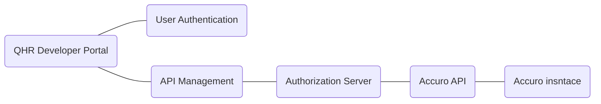
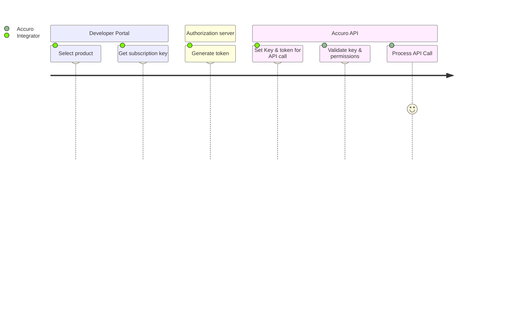
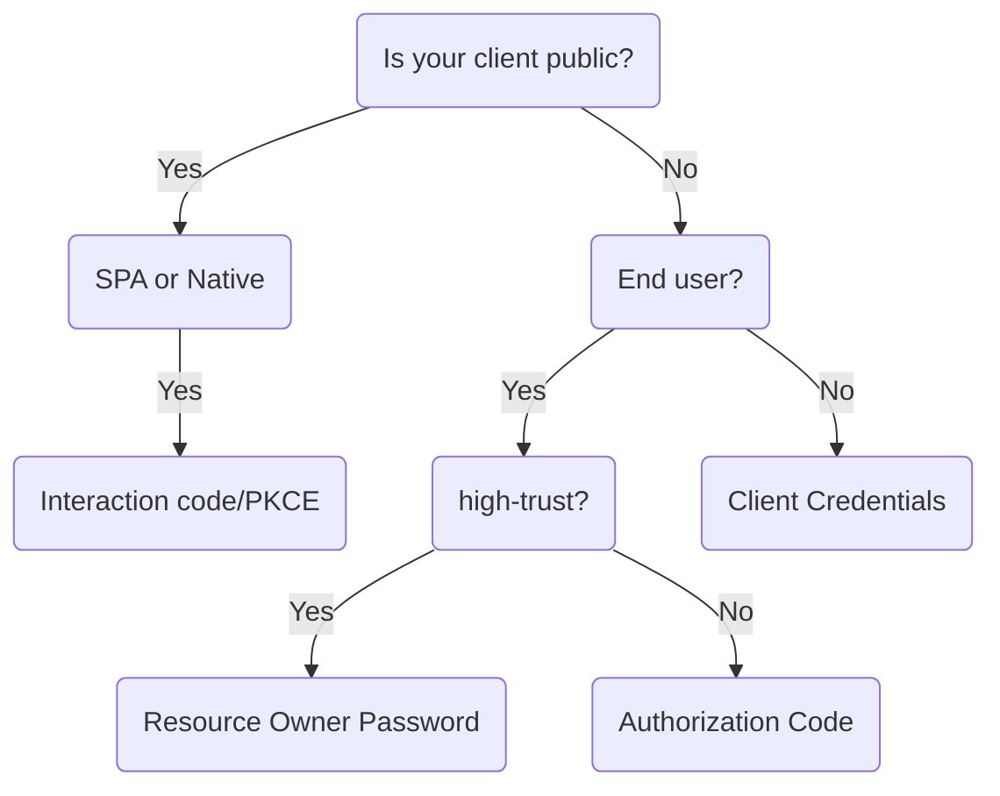

# Overview

Accuro API is the application interface module that allows to connect the different third-party applications with the different Accuro EMR processes. From a technical point of view, the Accuro API provides a remote operation to perform transactions, with three fundamental advantages:

**Easy integration:** your application has to create a REST request message encoding your transaction, send it over HTTPS to the web service and wait for a REST response message containing the status report of your transaction. Due to the fact that REST and HTTP are designed to be lightweight protocols, constructing requests and responses becomes a simple task, as there are a multitude of libraries available in almost all technologies. In general, constructing a REST request and handling the response is reduced to a few lines of code.

**Platform independence:** There are no requirements tied to a specific platform since the technology is an open and standards-based technology. In short, you are free to choose the technology you want (e.g., J2EE, PHP, ASP, C#, etc.) to make your application able to communicate with the Accuro API.

**Security:** All communication between your application and the Accuro API is managed under different security processes based on current standards for managing tokens (Stateless & Single Sign on), scopes, user permissions, and roles among the main ones. Finally, to perform any third-party application queries, it is required to perform the appropriate token generation steps based on the Accuro API standards to ensure that only trusted integrations can access the different Accuro EMR functionalities. These mechanisms, along with infrastructure-level security, ensure that transaction data sent to Accuro EMR remains private and is identified as valid query/transaction data.

**Some basic functionality includes:**

- Searching for and creating patients.
- Retrieving appointments and provider schedules.
- Adding patient lab results and observations.
- Retrieving documentation generated from a patient’s chart by an Accuro user.
- Uploading documents to a patient’s chart.
- Creating encounter notes within a patient’s chart.

## Architecture



### Journey



## Authentication Overview

Accuro's APIs must now be consumed under the OpenID Connect (OIDC) standard open authentication protocol that runs on top of the OAuth 2.0 framework. OIDC is one of the security protocols designed to protect **Single-Page Application:** that run in the browser where the client receives tokens (for example, Javascript, Angular, React, Vue), **Web Application:** Server-side applications where authentication and tokens are handled on the server (for example, Go, Java, ASP.Net, Node.js, PHP) and **Native Application:** Desktop or mobile applications that run natively on a device and redirect users to a non-HTTP callback (for example, iOS, Android, React Native) , this process delegates user authentication to the service provider hosting the user's account and authorizes third-party applications to access the user's account.

OIDC is similar to OAuth, where users grant one application permission to access data in another application without having to provide their username and password. Instead, tokens are used to complete both the authentication and authorization processes. Accuro identity tokens contain information about the user, principal, scope, and information about the application credentials and time allowed to access protected resources that is intended to be read and validated by the API. Its purpose is to inform the API that the holder of this token is authorized to access the API and perform certain actions (as specified by the granted scope). In order to generate the token, it is necessary to have the appropriate **client-id** ,**client-secret** & **scopes**, which will be generated once the integrator application has been configured.

Finally, Accuro API provides access to the data of many Accuro clinics. To enable this, Accuro API requires some information to determine which Accuro the application is trying to access. This required information is a **uuid**, which are unique to each Accuro instance.The **uuid** will be given and communicated to integrating applications for each Accuro they are authorized to access. For every request to the Accuro API, the **uuid** MUST be provided as a **query parameter**.

```js title=' Example '
`GET /resource?uuid={uuid of Accuro instance}`;
```

## Recommended flow

Depending on the type of application you are building, the table shows which flow to use.

| Application Type | OAuth 2.0 flow / grant type | Access Token? | ID Token? | Refresh Token? | Scopes required? |
|------------------|-----------------------------|---------------|-----------|----------------|------------------|
| SPA/Native       | PKCE / Interaction Code     | Yes           | Yes       | Yes            | Yes              |
| Server Side(Web) | Authorization Code          | Yes           | Yes       | Yes            | Yes              |
| Service          | Client Credentials          | Yes           | No        | No             | No               |



::::::info

**Is your client public?**

A client application is considered public when an end user could possibly view and modify the code. This includes Single-Page Apps (SPAs) or any mobile or native applications. In both cases, the application can't keep secrets from malicious users. Your client is considered confidential or private for server-side (web applications), which means your client can use client authentication such as a client secret.

**Is your client a SPA or native?**

The Interaction Code grant is typically used by native, SPA, and web client apps that want to interact directly with the user and mediate between the user and the authorization server, instead of using a browser-based redirect to hand off the authentication experience.

**Does the client have an end user?**

If your client application is running on a server with no direct end user, then it can be trusted to handle credentials and use them responsibly. If your client application is only doing machine-to-machine interaction, then you should use the Client Credentials flow.

**Is your app high-trust?**

If you own both the client application and the resource that it's accessing, then your application can be trusted to handle your end user's username and password. These types of apps are considered "high-trust". Because of the high degree of trust required, you should only use the Resource Owner Password flow if other flows aren't viable. If your app is not high-trust, you should use the Authorization Code flow.


